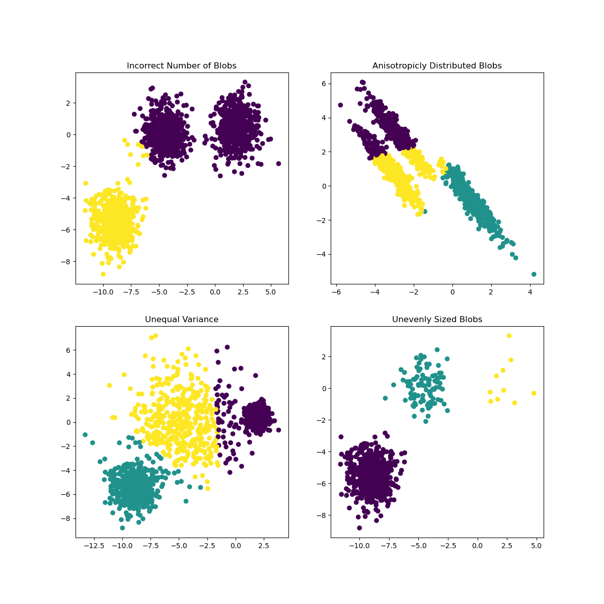

# K-means Algorithm

## 想法

1. 初始化一些假定质心，然后将所有数据点进行分类。
2. 分类后在所分类中计算新的质点，更新。

重复以上两步，如果最后发现质点变化不大，则说明拟合完成了！

## 算法实现要点

1. 初始化点的选择十分关键，这将直接影响最后分类的效果。
2. 计算距离的选择？

## 缺点

下图说明了其在数据层面的问题：

1. K值不正确时分出结果
2. 各向异性数据无法分类
3. 各cluster方差不同（聚合度并不太高）
4. 各cluster中元素个数差距可能较大

[](https://scikit-learn.org/stable/auto_examples/cluster/plot_kmeans_assumptions.html)

* 高维数据效率差（因为其在不断计算高斯距离），最好PCA之后再试试。


## sk-learn中的实现

> https://scikit-learn.org/stable/modules/clustering.html#k-means

```python
class sklearn.cluster.KMeans(n_clusters=8, *, init='k-means++', n_init=10, max_iter=300, tol=0.0001, precompute_distances='deprecated', verbose=0, random_state=None, copy_x=True, n_jobs='deprecated', algorithm='auto')
```

- **n_clusters***int, default=8*
- **init***{‘k-means++’, ‘random’}, callable or array-like of shape (n_clusters, n_features), default=’k-means++’*
  - k-means++ 效果最佳
  - 还可以人工指定形如(n_clusters, n_features)的节点
- **n_init***int, default=10*
  - 最大整体迭代次数，注意不是迭代深度，而是使用不同随机种子后的结果，最后会输出最佳的结果
- **max_iter***int, default=300*
  - 迭代深度
- **tol***float, default=1e-4*
  - 误差精度，计算点距离时的评价依据
- **verbose***int, default=0*
  - 输出更加详细的结果
- **random_state***int, RandomState instance or None, default=None*
  - 随机种子，用在生成初始随机质点上
- **copy_x***bool, default=True*
  - 为了计算精度问题会对数据进行改动，默认不改动，会将其复制一份
- **algorithm***{“auto”, “full”, “elkan”}, default=”auto”

### 属性

- **cluster_centers_***ndarray of shape (n_clusters, n_features)*
  - 分类质点信息
- **labels_***ndarray of shape (n_samples,)*
  - 每个点的标签（这是我们最想要的）
- **inertia_***float*
  - 所有样本点到质点集合的平方距离之和
- **n_iter_***int*
  - 迭代深度

### 例子

```python
>>> from sklearn.cluster import KMeans
>>> import numpy as np
>>> X = np.array([[1, 2], [1, 4], [1, 0],
...               [10, 2], [10, 4], [10, 0]])
>>> kmeans = KMeans(n_clusters=2, random_state=0).fit(X)
>>> kmeans.labels_
array([1, 1, 1, 0, 0, 0], dtype=int32)
>>> kmeans.predict([[0, 0], [12, 3]])
array([1, 0], dtype=int32)
>>> kmeans.cluster_centers_
array([[10.,  2.],
       [ 1.,  2.]])
```

### 方法

- `fit`(*X*, *y=None*, *sample_weight=None*)[[source\]]
  - self

y不用指定。sample_weight为特征权重向量

* `fit_predict`(*X*, *y=None*, *sample_weight=None*)
  * **labels***ndarray of shape (n_samples,)*
* `fit_transform`(*X*, *y=None*, *sample_weight=None*)
  * **X_new***ndarray of shape (n_samples, n_clusters)*
  * X_new.row会表示每一个样本到各个clusters之间的距离
* `get_params`(*deep=True*)
  * **params***dict*
* `predict`(*X*, *sample_weight=None*)
  * **labels***ndarray of shape (n_samples,)*
* `score`(*X*, *y=None*, *sample_weight=None*)
  * 衡量分类效果
  * **score***float*
* `set_params`(***params*)
  * **self***estimator instance*
* `transform`(*X*)
  * **X_new***ndarray of shape (n_samples, n_clusters)*

